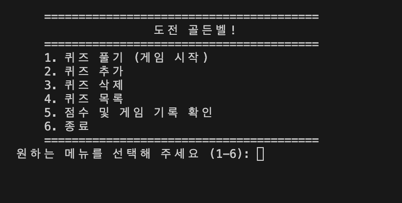
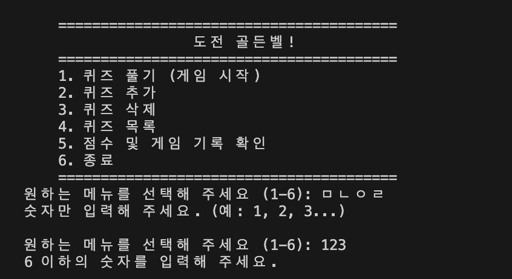
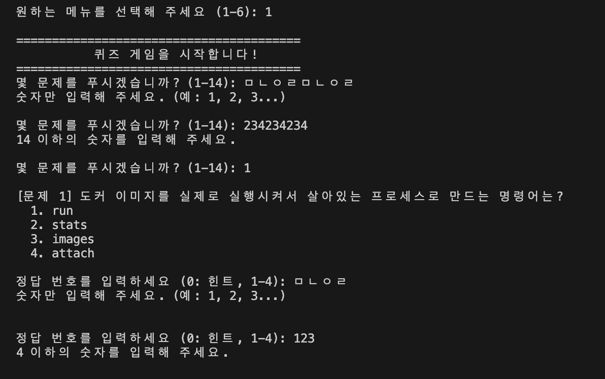
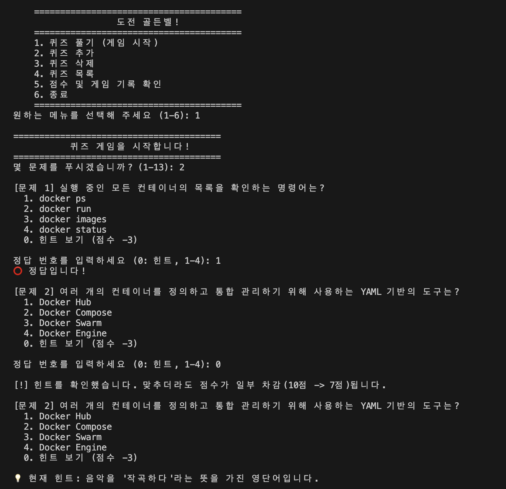
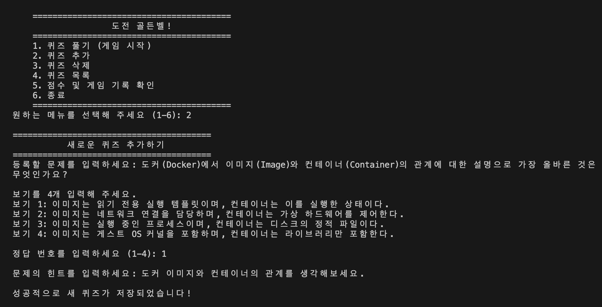
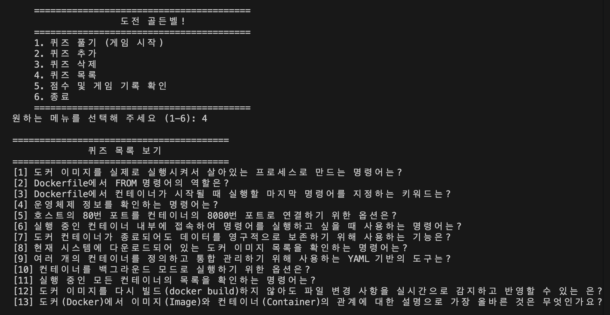
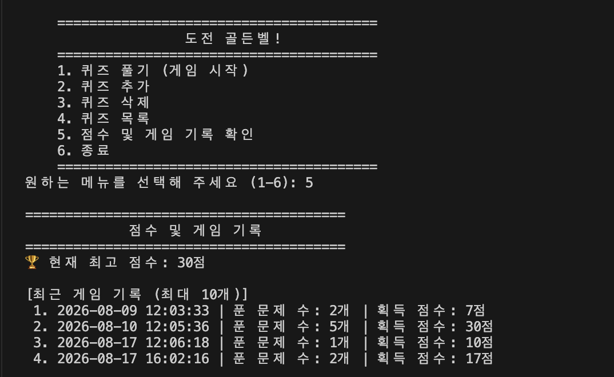
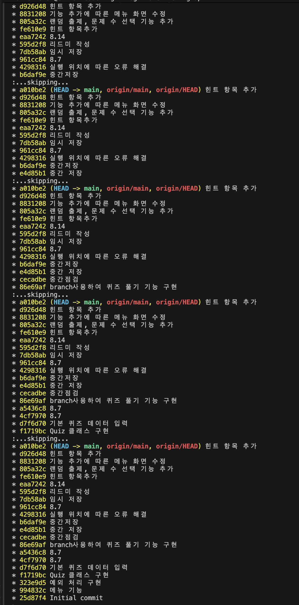
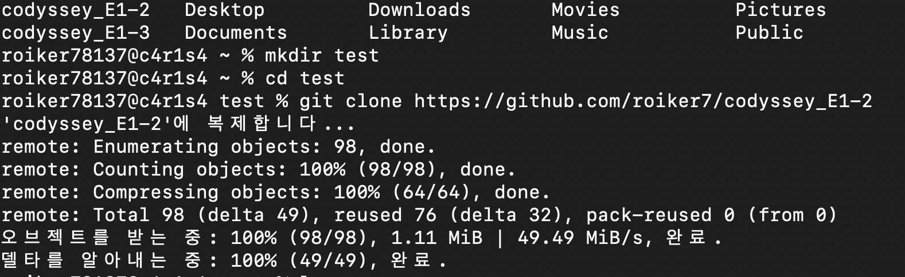

# codyssey_E1-3
> 컴퓨터에게 명령 내리는 말(파이썬) 처음 배우기

# 개발 환경
- Python 3.8 이상
- 외부 라이브러리 사용 금지(NumPy, pandas 등)
- 표준 라이브러리(json, time 등)만 허용
```
$python --version
Python 3.12.13

import random
import json
import os
import sys
```
# 퀴즈 주제 및 선정 이유
퀴즈 주제: Docker 기초 지식 <br>
선정 이유: 과제 1에서 도커와 터미널에 관한 개념을 학습한 뒤 그 과정에서 나 스스로가 헷갈린 문제나 개념을 문제로 만들면서 다시 상기시키기 위해 Docker를 주제로 정했습니다.

# 실행 방법
별도의 외부 라이브러리 설치 없이 Python 3 환경에서 바로 실행할 수 있습니다.
```
# 1. 저장소 클론 (Clone)
git clone <https://github.com/roiker7/codyssey_E1-2>

# 2. 프로젝트 디렉터리 이동
cd quiz_game

# 3. 메인 프로그램 실행
python main.py
```

# 주요 기능 및 실행 화면
| 기능 | 설명 |
| --- | --- |
| 퀴즈 풀기 | 등록된 퀴즈를 순서대로 풀고 정답 여부와 점수를 계산합니다. 최고 점수 경신 시 자동 저장됩니다. |
| 퀴즈 추가 | 문제, 보기 4개, 정답 번호를 입력하여 새로운 퀴즈를 등록하고 파일에 저장합니다. |
| 퀴즈 목록 | 현재 저장되어 있는 모든 퀴즈 문제와 정답 번호를 출력합니다. |
| 점수 확인 | 현재 기록된 최고 점수를 확인합니다. |
| 예외 처리 | 잘못된 숫자인자/문자 입력, 공백 입력, 비정상 종료 요청을 안전하게 처리합니다. |	


### 🔹 메인 메뉴 화면


### 🔹 메인 메뉴 예외처리


### 🔹 퀴즈 실행 예외처리


### 🔹 퀴즈 풀기 진행


### 🔹 새로운 퀴즈 추가


### 🔹 퀴즈 목록 보기


### 🔹 점수 확인


### 🔹 git log


### 🔹 git clone



# 파일 구조
```
CODYSSEY_E1-2/
│
├── app/                      # 소스코드 디렉터리
│   ├── game.py               # QuizGame 클래스 (전체 게임 흐름 및 메뉴 로직)
│   ├── main.py               # 프로그램 시작점 (메인 메뉴 루프 실행)
│   ├── quiz.py               # Quiz 클래스 (개별 퀴즈 객체 및 딕셔너리 변환)
│   ├── storage.py            # 파일 입출력 (state.json 읽기/쓰기 및 복구)
│   └── utils.py              # 공통 입력 검증 및 예외 처리 모듈
│
├── .gitignore         # Git 추적 제외 파일 설정
├──  학습
│    ├── 새롭게 알게 된 내용.txt          # 학습 및 프로젝트 정리 파일
│    └── 추가로 구현해 보고 싶은 기능.txt   # 추가 기능 아이디어 기록 파일
├── README.md           # 프로젝트 문서
└── state.json          # 퀴즈 데이터 및 최고 점수 저장 파일 
```


# 데이터 파일 설명 (state.json)
- 파일 경로: 프로젝트 루트 디렉터리 (/state.json)
- 역할: 퀴즈 목록과 사용자의 최고 점수를 영구적으로 저장하고 읽어옵니다.
- 인코딩: UTF-8

실제 데이터 필드 구조 
```
{
  "best_score": 0,
  "quizzes": [
    {
      "question": "도커 이미지를 실제로 실행시켜서 살아있는 프로세스로 만드는 명령어는?",
      "choices": [ "run", "stats", "images", "attach" ],
      "answer": 1
    }
  ]
}
```
| 키 (Key) | 타입 (Type) | 설명 |
| :--- | :--- | :--- |
| `best_score` | Integer | 사용자가 퀴즈 풀기를 통해 달성한 최고 점수 (1문제당 10점) |
| `quizzes` | Array(Object) | 퀴즈 객체 목록 |
| └ `question` | String | 퀴즈 문제 텍스트 |
| └ `choices` | Array(String) | 4개의 보기 문항 리스트 |
| └ `answer` | Integer | 정답 보기 번호 (1 ~ 4) |


# 과제 목표
- 변수가 무엇이고, 왜 사용하는지 설명할 수 있다.
- int, str, bool, list, dict의 차이를 설명할 수 있다.
- if/elif/else로 조건에 따라 다른 동작을 수행할 수 있다.
- for와 while의 차이를 설명하고 적절히 선택할 수 있다.
- 함수를 정의하고, 매개변수와 반환값을 활용할 수 있다.
